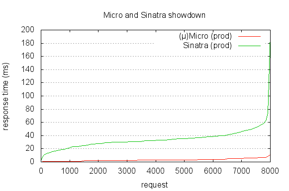

## [(µ)Micro](http://micro-docs.simplegames.ca/) and [Sinatra](http://www.sinatrarb.com/) showdown

### The goal  
  
Comparing the performance of two simple "Hello World" web applications using the Micro and Sinatra frameworks. The two apps will run in **production** mode and the "audience" will be a room full with opinionated [ab](http://httpd.apache.org/docs/2.2/programs/ab.html) audiophiles making 8,000 requests. The benchmark is simple: a short run to warm the frameworks up (100 requests, 10 concurrently). Ran the big bench at 8,000 requests, 50 concurrently, and the best run out of five was recorded and compared. A future test will measure the memory consumption using the passenger-memory-stat for Sinatra and Micro's internal `sys/info` support for collecting data about the memory consumption, CPU usage and GC activity. For now we keep the things simple.

### The "stage"
Micro is using the embedded [Jetty 6.1.21](http://jetty.codehaus.org/jetty/) server and Sinatra will use [Thin (v1.5.0 codename Knife)](http://code.macournoyer.com/thin/). Other details:

- A Mac having the following characteristics: `2.8 GHz Intel Core i5, 8 GB 1067 MHz DDR3`
- **Java**: `version "1.6.0_41", 64-Bit Server VM (build 20.14-b01-445, mixed mode)` 
- **Ruby**: `1.9.3p327 (2012-11-10 revision 37606) [x86_64-darwin12.2.0]`

### The web application

A very simple "Hello World" web application with a very basic layout, and including some CSS for adding some static resources into the mix. Micro is using the default template view renderer: [Velocity](http://velocity.apache.org/), and the Sinatra app will use **ERB**, which is included with Ruby. The view templates will be stored in distinct files, using inline templates being out of scope; sorry Sinatra ;)

### Tools

 - [ab](http://httpd.apache.org/docs/2.2/programs/ab.html) - the Apache HTTP server benchmarking tool
 - [Gnuplot](http://www.gnuplot.info/) - a portable command-line driven graphing utility for Linux, OS/2, MS Windows, OSX, VMS, and many other platforms.

### The results

command used: `ab -n 8000 -kc 50 http://localhost:8080/index.html`, and these are the best results out of five runs:

  

**Sinatra**

    Server Software:        thin
    Server Hostname:        localhost
    Server Port:            8080

    Document Path:          /index.html
    Document Length:        733 bytes

    Concurrency Level:      50
    Time taken for tests:   5.420 seconds
    Complete requests:      8000
    Failed requests:        0
    Write errors:           0
    Keep-Alive requests:    8000
    Total transferred:      7728000 bytes
    HTML transferred:       5864000 bytes
    Requests per second:    1476.10 [#/sec] (mean)
    Time per request:       33.873 [ms] (mean)
    Time per request:       0.677 [ms] (mean, across all concurrent requests)
    Transfer rate:          1392.49 [Kbytes/sec] received

    Connection Times (ms)
                  min  mean[+/-sd] median   max
    Connect:        0    0   0.1      0       2
    Processing:     3   34  12.5     33     191
    Waiting:        3   34  12.5     33     191
    Total:          3   34  12.5     33     193

    Percentage of the requests served within a certain time (ms)
      50%     33
      66%     36
      75%     38
      80%     40
      90%     48
      95%     55
      98%     63
      99%     75
     100%    193 (longest request)
    

**(µ)Micro**

    Server Software:        Jetty(6.1.21)
    Server Hostname:        localhost
    Server Port:            8080

    Document Path:          /index.html
    Document Length:        738 bytes

    Concurrency Level:      50
    Time taken for tests:   0.497 seconds
    Complete requests:      8000
    Failed requests:        0
    Write errors:           0
    Keep-Alive requests:    8000
    Total transferred:      6812750 bytes
    HTML transferred:       5915070 bytes
    Requests per second:    16107.60 [#/sec] (mean)
    Time per request:       3.104 [ms] (mean)
    Time per request:       0.062 [ms] (mean, across all concurrent requests)
    Transfer rate:          13395.64 [Kbytes/sec] received

    Connection Times (ms)
                  min  mean[+/-sd] median   max
    Connect:        0    0   0.1      0       2
    Processing:     0    3   1.8      3      11
    Waiting:        0    3   1.8      3      11
    Total:          0    3   1.8      3      11

    Percentage of the requests served within a certain time (ms)
      50%      3
      66%      3
      75%      4
      80%      4
      90%      6
      95%      7
      98%      7
      99%      8
     100%     11 (longest request)

  
### Notes ###

Please check the web applications I used for this test and feel free to recommend a better way of configuring running the Sinatra app, eventually using a different web server than Thin. Pull-requests are welcomed.

